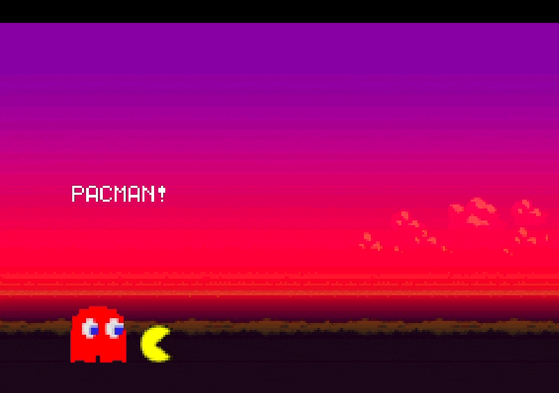
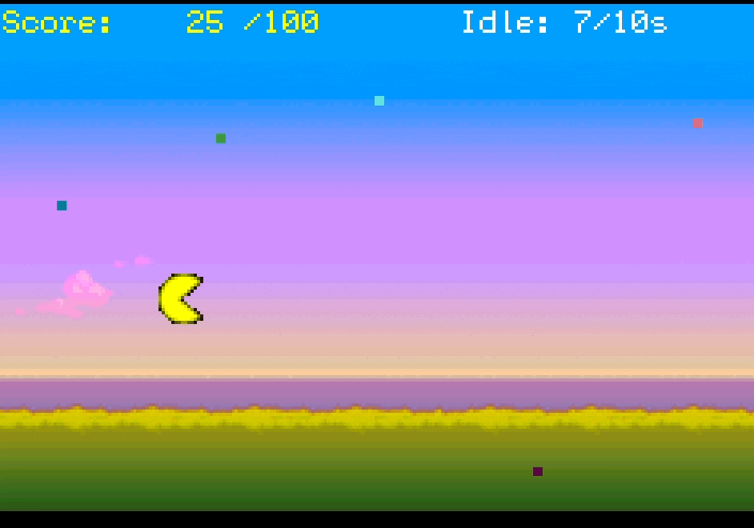

# 🎮 Pacman for Game Boy Advance

Welcome to a retro-style **Pacman clone**, reimagined for the **Game Boy Advance**!  
Made for homework using C.

---


## How to Play

### Controls

- **Arrow Keys** — Move Pacman around  
- **START** — Begin or resume the game  
- **SELECT** — Reset to the title screen from anywhere

### 🏁 Goal

- 🟡 Eat moving dots that fly in from the right
- 💯 Reach **100 points** to win
- ⏱ If you don’t eat a dot for **10 seconds**, you lose




---

## How to Run This Game (Using Docker + mGBA)

This game is ready to run using a pre-configured Docker container that opens an emulator for you.

### ✅ Requirements

- **Java 11+**
- **Docker installed and running**
- OS: macOS / Linux / Windows

### ▶️ Steps to Launch

1. **Open your terminal / command prompt**

2. `cd` into the folder where you downloaded or cloned this game:
   ```bash
   cd path/to/your/pacman-folder
3. Run the platform-specific launch script:
####On macOS or Linux:
    ```bash
    ./cs2110docker-gba.sh
####on Windows
    ```bash
    cs2110docker-gba
4. Once inside the Docker container, build and run the game with:
    ```bash
    make mgba

### 🎵 Features 
- **Target System**: Targets appear from the right and slide left. Each collected pellet increases the score.
- **Animated Player**: The Pacman sprite switches between two animation frames for a lively appearance.
- **Idle Timeout**: A countdown timer in red tracks how long the player has not collected a pellet.
- **Score UI**: The top-left displays `Score: X/100`, and idle time is shown live.
- **Background Music**: Full *Super Mario Bros* theme plays on the title screen using sound channel 2.
- **No screen flickering**: Carefully optimized redrawing ensures a smooth gameplay experience.
- **State Reset**: SELECT key resets the entire game state cleanly, including score and idle timers.
